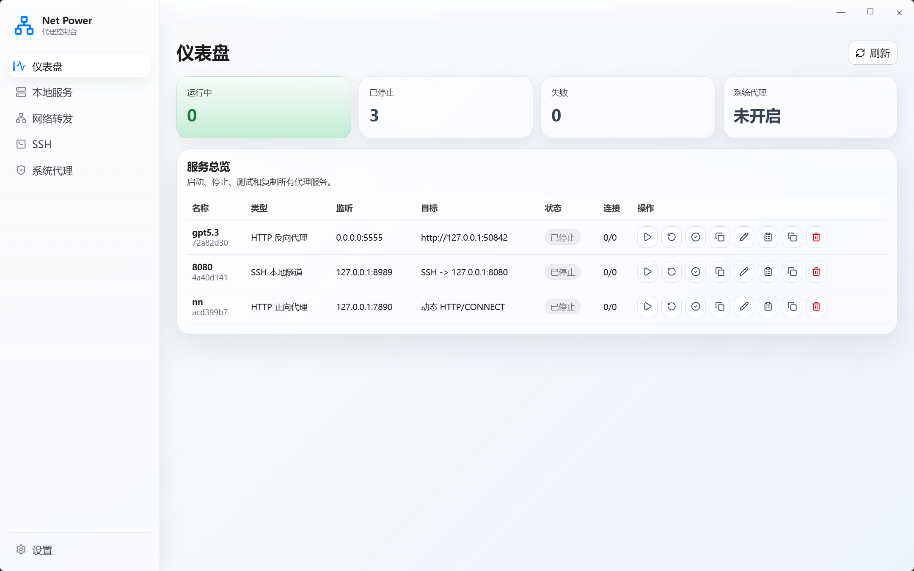

<!-- @author kongweiguang -->

# net-power

net-power 是一个跨平台桌面代理管理工具，基于 Rust、Tauri 和 React 构建。它把本地代理服务、系统代理、SSH 转发和运行日志集中到一个桌面工作台中管理。



## 主要能力

- 管理本地代理服务：创建、编辑、复制、启动、停止、重启和软删除。
- HTTP 代理：支持 reverse proxy、forward proxy、HTTPS CONNECT、Header 规则和 Body rewrite。
- TCP/UDP 转发：支持常见端口转发场景。
- 转发工作台：统一管理 HTTP Reverse、HTTP Forward、TCP Forward 和 UDP Forward 配置，支持本地或局域网启动范围和一键复制访问地址。
- SSH 转发：支持本地转发、远程转发、SOCKS5 动态代理、跳板机、多级跳板、自动重连，以及从 SSH Profile 打开系统终端。
- 系统代理：支持 Windows、macOS、Linux 的代理设置、清理和状态读取。
- 配置持久化：使用 SQLite 保存服务配置、设置和运行数据，默认位于 `~/.net-power/proxy-tool.db`。
- 运行日志：按服务查看连接、状态、耗时、字节和结构化 meta 信息。
- 工具服务：创建、编辑并启动可持久化 HTTP 服务，可挂载静态目录、选择目录浏览或静态网站模式，并配置多个接口响应。
- 桌面体验：系统托盘、关闭隐藏到托盘、开机启动和响应式工作台。
- 主题外观：设置页支持浅色、深色和跟随系统主题，工作台组件颜色统一随主题切换。
- 自动更新：通过 Tauri updater 从 GitHub Releases 检查、下载和安装更新。

## 使用方法

安装依赖：

```bash
npm install
```

启动桌面开发模式：

```bash
npm run tauri dev
```

仅启动前端调试：

```bash
npm run dev
```

构建桌面安装包：

```bash
npm run tauri -- build
```

运行常用检查：

```bash
npm run build
npm test
cd src-tauri
cargo fmt --check
cargo test
cargo clippy -- -D warnings
```

## 发布与更新

- GitHub Actions 已配置桌面端 CI 和 Release workflow。
- 推送 `v*.*.*` tag 后会构建 Windows NSIS、macOS Intel/Apple Silicon DMG、Linux AppImage/DEB。
- Release 会上传 Tauri updater 使用的 `latest.json`。
- 当前 updater endpoint：`https://github.com/kongweiguang/net-power/releases/latest/download/latest.json`。

## 文档

- [docs/README.md](docs/README.md)：文档索引。
- [docs/user/README.md](docs/user/README.md)：使用帮助、功能选择和各功能数据流转说明。
- [docs/product/README.md](docs/product/README.md)：产品目标、范围、信息架构和交付标准。
- [docs/business/README.md](docs/business/README.md)：业务能力说明。
- [docs/engineering/architecture.md](docs/engineering/architecture.md)：架构说明。
- [docs/engineering/testing.md](docs/engineering/testing.md)：测试和验收说明。
