<!-- @author kongweiguang -->

# 使用帮助

这份帮助文档面向第一次打开 net-power、还不确定该点哪个功能的用户。阅读时不用先理解架构，只需要先回答一个问题：你现在想让哪一段网络流量变得可控？

## 先按目标选功能

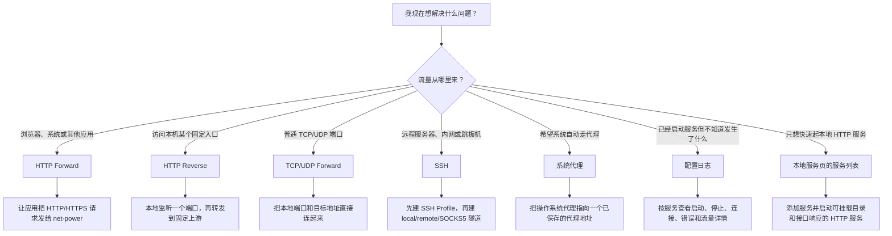

## 最常见的使用路线

1. 先创建配置：在网络转发、SSH 或系统代理页面新增一条配置。
2. 再启动服务：只有网络转发和 SSH 隧道这类网络服务需要启动；系统代理是操作系统设置，不等同于服务本身。
3. 看运行状态：仪表盘和配置列表会展示运行状态、连接数、字节统计和最近错误。
4. 查日志定位问题：点配置行里的“日志”，按级别、协议、时间和关键词筛选。
5. 需要系统接管时再启用系统代理：系统代理会影响浏览器或系统网络设置，建议先确认目标服务已经可用。

## 功能速查

HTTP Reverse、HTTP Forward、TCP Forward 和 UDP Forward 都在“网络转发”页面维护。

| 你想做的事 | 应该用哪个功能 | 需要先准备什么 |
| --- | --- | --- |
| 把本机端口转发到固定 HTTP 上游，并改 header 或 body | HTTP Reverse | 本地监听端口、上游 URL、可选 rewrite 规则 |
| 让浏览器或工具通过 net-power 访问 HTTP/HTTPS | HTTP Forward | 本地监听端口，必要时开启 CONNECT |
| 把本地 TCP 端口转到另一台机器 | TCP Forward | 本地监听地址、目标 host/port |
| 转发 UDP 请求，例如某些 DNS 或自定义 UDP 服务 | UDP Forward | 本地监听地址、目标 host/port、idle 清理时间 |
| 把 SSH Server 可访问的服务映射到本机端口 | SSH Local Tunnel | SSH Profile、本地监听地址、远程目标地址 |
| 让远程服务器监听端口并回连本机服务 | SSH Remote Tunnel | SSH Profile、远程绑定地址、本机目标地址 |
| 把 SSH 当作动态 SOCKS5 代理 | SSH SOCKS5 | SSH Profile、本地 SOCKS5 监听端口 |
| 创建本地文件服务或接口响应 | 本地服务 | 启动范围、端口、可选静态目录、静态目录模式、接口路径和响应内容 |
| 一键切换系统代理 | System Proxy | 要写入系统的 host、port、bypass 列表 |
| 排查服务为什么失败或变慢 | 配置日志 | 先选择对应服务，再打开日志弹框 |
| 控制应用是否随系统启动 | 设置 | 区分“开机启动应用”和“服务自动启动”，并查看版本与 GitHub 地址 |

## 各功能的数据怎么走

下面这些图描述的是“网络流量怎么走”，不是代码模块调用。先看箭头方向，再看监听端口和目标端口，一般就能判断该用哪个功能。

### HTTP Reverse：本机固定入口转到固定上游

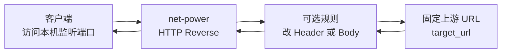

适合场景：你希望别人访问 `本机端口`，net-power 再把请求转发到一个固定 HTTP 上游。Header rewrite、Body rewrite 都发生在 net-power 这一层。

### HTTP Forward：应用把代理请求交给 net-power

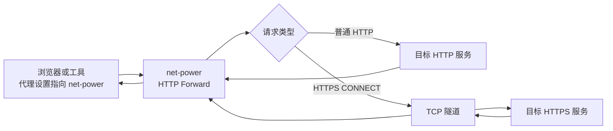

适合场景：你想让浏览器、curl、npm、开发工具这类客户端通过一个代理出口访问外部 HTTP/HTTPS。HTTPS CONNECT 建立后，net-power 只搬运加密字节，不解密 HTTPS 内容。

### 本地服务：创建本地 HTTP 文件或接口响应

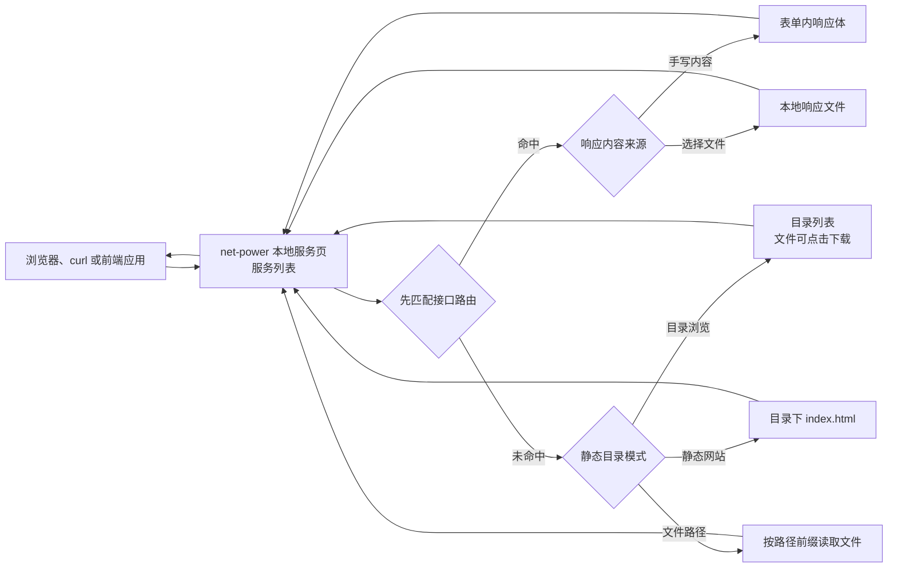

适合场景：你只是需要快速起一个本地 HTTP 服务，不想创建完整代理配置。一个工具服务可以同时预览本地文件夹并提供几个接口；接口响应体可以直接填写，也可以通过文件选择器指向本地文件。静态目录选择“目录浏览”时会生成文件列表，选择“静态网站”时目录请求会优先返回 `index.html`。配置会保存到 SQLite，暂停后仍留在本地服务页的服务列表里，编辑运行中的服务会按新配置重启。

### TCP Forward：本机 TCP 端口直连目标 TCP

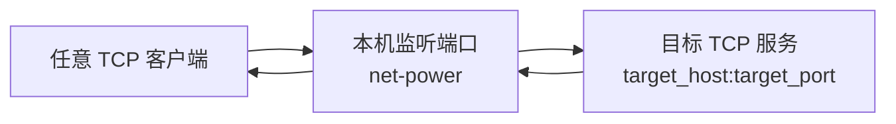

适合场景：协议不是 HTTP，但它基于 TCP，比如数据库、Redis、自定义 TCP 服务。net-power 不理解业务协议，只负责双向复制字节。

### UDP Forward：按客户端地址维护 UDP 映射

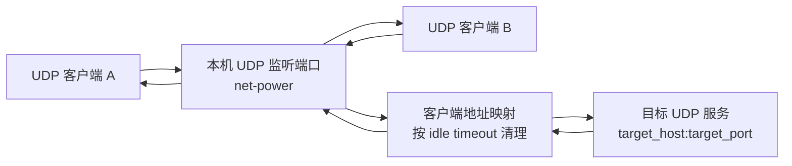

适合场景：DNS 或其他 UDP 请求转发。UDP 没有连接，net-power 会按客户端地址记住“谁发来的”，目标响应回来后再写回原客户端。

### SSH Local：把远端可访问的服务映射到本机端口

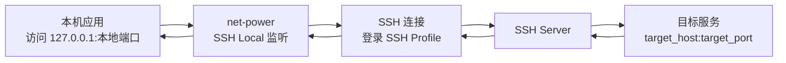

人话说明：这是最像“把服务器那边的端口映射到本机”的功能。更准确地说，它把 SSH Server 能访问到的 `target_host:target_port` 映射成本机的一个监听端口。  
例子：本机访问 `127.0.0.1:3307`，实际通过 SSH 连到服务器，再访问服务器内网里的 `db.internal:3306`。

### SSH Remote：把本机服务暴露到 SSH Server 的端口

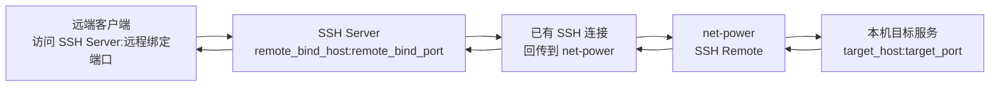

人话说明：这是反过来的方向。远端用户访问 SSH Server 上的端口，流量通过 SSH 连接回到你的电脑，再打到你本机或本机可访问的目标服务。  
例子：别人访问 `ssh.example.com:18080`，实际进入你电脑上的 `127.0.0.1:8080`。

### SSH SOCKS5：本机动态代理，目标由客户端决定

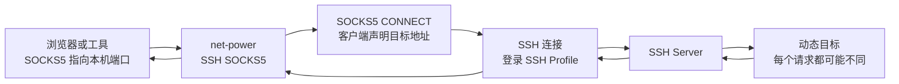

适合场景：你不想为每个远端服务单独建 SSH Local，而是让浏览器或工具通过一个 SOCKS5 入口动态访问多个目标。目标地址由客户端每次 CONNECT 时决定。

### System Proxy：让系统应用自动走某个代理地址

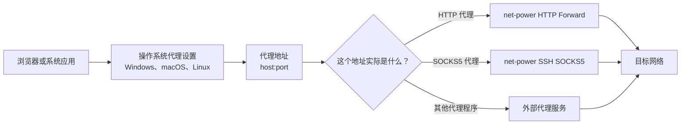

人话说明：系统代理只是把系统里的应用引到某个 `host:port`，它本身不产生代理能力。通常要先启动 HTTP Forward 或 SSH SOCKS5，再把系统代理指向这个监听地址。

### 配置和日志：所有功能共用的后台链路

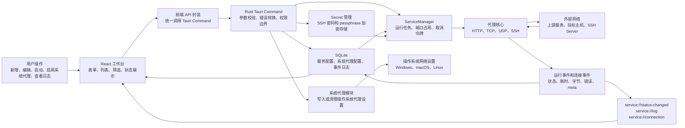

这张图解释的是应用后台怎么管理配置和日志，可以按三条线理解：

- 配置线：用户在界面保存配置，Rust 校验后写入 SQLite。前端不直接写数据库，也不保存 SSH 明文。
- 运行线：用户启动服务后，ServiceManager 从 SQLite 读取配置，创建后台任务，再交给对应代理核心处理真实网络连接。
- 反馈线：代理核心把启动、停止、连接、错误和流量统计写入事件，再同时落库和推送给界面，所以你既能看到实时状态，也能回头查历史日志。

## 容易混淆的概念

| 概念 | 人话解释 |
| --- | --- |
| 服务配置 | 保存下来的规则，例如监听哪个端口、转发到哪里、是否启用 rewrite。 |
| 工具服务 | 本地服务页服务列表里创建的本地 HTTP 服务，可挂载静态目录和接口响应；配置持久化保存，启动/暂停只影响运行态。 |
| 运行态 | 当前真的在后台跑的任务。应用重启后运行态会消失，需要按自动启动策略重新恢复。 |
| 启动范围 | 监听地址的人话选择。本地模式只绑定 `127.0.0.1`，局域网模式绑定 `0.0.0.0` 并允许同网段设备访问。 |
| 系统代理 | 操作系统级设置，会让浏览器或应用把流量发到指定代理地址；它本身不是代理服务。 |
| HTTP Forward | net-power 作为通用代理，别人把请求交给它，它再往外发。 |
| HTTP Reverse | net-power 作为固定入口，收到请求后转到指定上游。 |
| SSH Profile | 登录 SSH server 的身份信息。隧道复用 Profile，但 Profile 本身不是隧道。 |
| SSH Tunnel | 真正的 SSH 转发规则，例如 local、remote 或 SOCKS5。 |
| 开机启动应用 | 系统登录后自动打开 net-power。 |
| 服务自动启动 | net-power 启动后，按配置恢复指定代理服务。 |

## 建议的排查顺序

1. 看配置是否保存成功：刷新列表后配置还在，说明 SQLite 配置链路正常。
2. 看服务是否启动：状态不是 Running 时，先打开配置日志看错误。
3. 看端口是否冲突：同一个本地监听端口不能被多个服务同时占用。
4. 看目标是否可达：HTTP 上游、TCP/UDP 目标或 SSH server 不可达时，net-power 只能记录失败原因，不能替目标恢复网络。
5. 看系统代理是否指向正确服务：启用系统代理前，确认对应 HTTP Forward 或 SOCKS5 服务已经启动。

## 深入阅读

- 业务能力细节见 [../business/README.md](../business/README.md)。
- 架构调用链见 [../engineering/architecture.md](../engineering/architecture.md)。
- SQLite 表职责见 [../engineering/database.md](../engineering/database.md)。
- Secret、日志脱敏和系统权限见 [../engineering/security.md](../engineering/security.md)。
